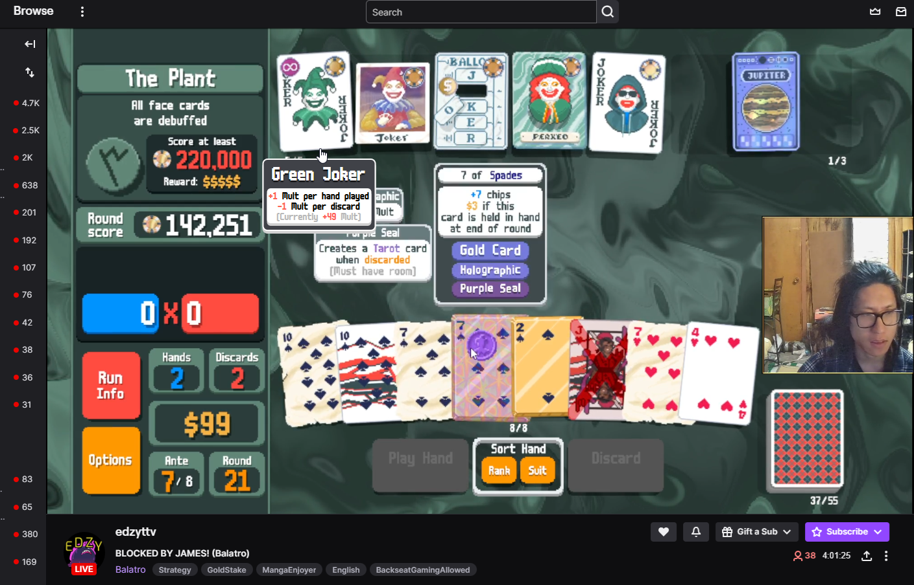

# "Slay the Jokers" Overlay Mod

⚡ **Just want to install the mod quickly and don't care about anything else?** Follow the [TL;DR installation guide](docs/TLDR-INSTALL.md) for a fast setup.  
- However, I do recommend to continue reading instead, unless you've installed mods before.

## Overview

A mod that allows your viewers to hover over cards on your stream to see their effects and current values.

Does not require `steamodded`.

*(Screenshotted from [edzyttv](https://www.twitch.tv/edzyttv)'s stream, used with permission)*

---

If you need help, have suggestions, or need an upload key, feel free to contact me at `itsedalo@gmail.com`.

## Installation

The installation guide can be found [`here`](INSTALL.md). Be sure to **read the `Things to Know Before Installing` section below** before installing.

## Things to Know Before Installing

- **Upload Key**: To use this mod, you'll need an upload key to the Slay the Jokers server.
    - You can get one using the automated system at https://edalo.net/stj (you will need to verify your Twitch account to prove it's really you).
    - If something goes wrong or you prefer not to authorize, you can request a key at `itsedalo@gmail.com`.
        - Absolutely no need for anything formal or polite, you can just say `Hi, I'm <twitch name>, give me a key`

- **Windows and Steam only**: This mod supports only the **Steam** version of the game on **Windows**.
    - The Xbox Game Pass PC version is not supported as it is incompatible with the required `Lovely` injector.

- **Stream Overlays**: This mod currently only works correctly if the game is shown at a 16:9 resolution (like 1920x1080 / 4K / 8K) and **fills the entire visible area of the stream**. Overlays that crop or reposition the game may cause card positions to misalign.
    - If that's a dealbreaker, feel free to contact me - I might be able to make it work for your setup.

- **Other Mods & Compatibility**: This mod is **compatible** with almost all other mods.
    - Mods that **modify existing** card effects are **not** compatible (the original card's effect will be shown instead).

- **Disclaimer**: This mod is still under development, so some features might not work perfectly. If you encounter any issues, please let me know!
    - *More formal disclaimer for meanies: this project is a hobby project, provided as-is, with no guarantees of stability, correctness, or suitability for any purpose. You're welcome to use it - but I take no responsibility if something goes wrong.*

## Acknowledgments

Big Thank Yous to all the following people:

- [@tusharsadhwani](https://github.com/tusharsadhwani) for the suggestion and implementation of the `uv` package manager usage
- [@yotka2](https://github.com/yotka2) for helping with the server setup and maintenance
- [@espav](https://twitch.tv/espav) for being the extension's first tester and providing invaluable feedback
- [@edzy](https://twitch.tv/edzyttv) for helping debug the mod and lending his face to the extension's cover image
- [@Boop Dog](https://github.com/goBoopADog) for creating the mod's Balatro Mod Index page
